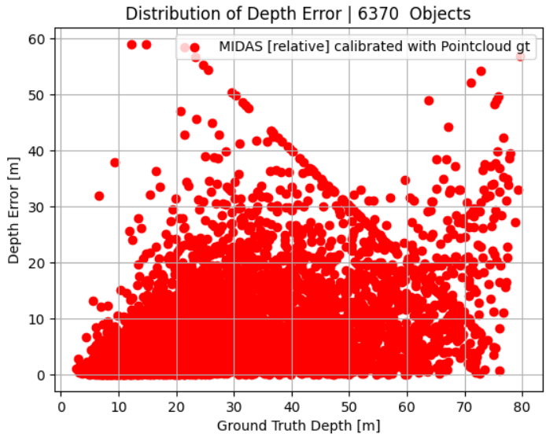
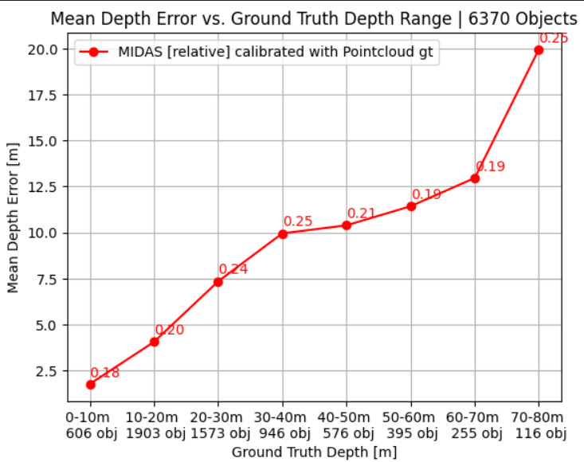
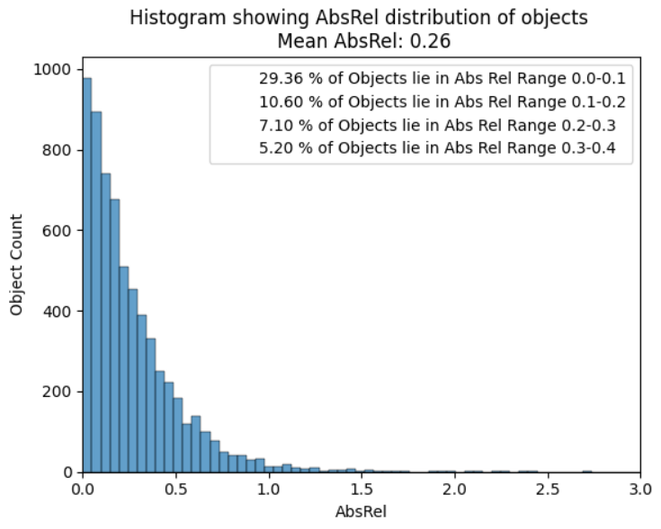

<link rel="stylesheet" href="https://cdn.jsdelivr.net/npm/katex@0.10.2/dist/katex.min.css" integrity="sha384-yFRtMMDnQtDRO8rLpMIKrtPCD5jdktao2TV19YiZYWMDkUR5GQZR/NOVTdquEx1j" crossorigin="anonymous">
<script defer src="https://cdn.jsdelivr.net/npm/katex@0.10.2/dist/katex.min.js" integrity="sha384-9Nhn55MVVN0/4OFx7EE5kpFBPsEMZxKTCnA+4fqDmg12eCTqGi6+BB2LjY8brQxJ" crossorigin="anonymous"></script>
<script defer src="https://cdn.jsdelivr.net/npm/katex@0.10.2/dist/contrib/auto-render.min.js" integrity="sha384-kWPLUVMOks5AQFrykwIup5lo0m3iMkkHrD0uJ4H5cjeGihAutqP0yW0J6dpFiVkI" crossorigin="anonymous" onload="renderMathInElement(document.body);"></script>

# Project Goal

The purpose of this project is to investigate whether or not MIDAS can be used to predict the depth of objects in the KITTI dataset. \
Since MiDas predicts relative depth, we assume that we are able to do the conversion from relative to metric depth given the groundtruth measurements.


# Model Under Test

| MiDaS Model          | DIW WHDR | Eth3d AbsRel | Sintel AbsRel | TUM δ1  | KITTI δ1  | NYUv2 δ1 | Imp. % | Par. M | FPS  |
|----------------------|----------|--------------|---------------|---------|-----------|-----------|--------|--------|------|
| **Inference height 224** |          |              |               |         |           |           |        |        |      |
| v3.1 LeViT<sub>224</sub>  | 0.1314   | 0.1206       | 0.31        | 18.21   | 15.27*    | 8.64*     | -40     | 51    | 73  |


# KITTI Dataset

MiDaS is trained using the kitti eigen train split (23158 Images). Therefore, this set must not be part of our evaluation. \
Furthermore, we are interested in determining the 3D object center, since we represent the object depth using the depth measurement at the 3D object center. \
The 3D object center is determined by projecting the 3D pose of the object (from the 3D Object set labels txt files) to the image plane using the projection matrix. 
To map the images from the depth estimation set to the 3D object detection one, we use the mapping given by [train_mapping.txt & train_rand.txt](https://github.com/bostondiditeam/kitti/tree/master/resources/devkit_object/mapping)

Since we are interested in evaluating the objects depth we use the 3D Object Detection labels. 

[KITTI Depth Estimation Dataset](https://www.cvlibs.net/datasets/kitti/eval_depth_all.php) \
[KITTI 3D Object Detection Dataset](https://www.cvlibs.net/datasets/kitti/eval_object.php?obj_benchmark=3d) 


$$

\textbf{KITTI Depth Estimation Dataset:}\\
\text{Training Set: } D_{\text{train}} = 85898 \text{ Images}\\
\text{Validation Set: } D_{\text{val}} = 6852 \text{ Images}\\
\text{Total Images: } D = D_{\text{train}} \cup D_{\text{test}} = 92750 \text{ Images} \\
\text{Eigen Train Split: } D_{\text{EigenTrainSplit}} = 23158 \text{ Images} \\

\textbf{KITTI 3D Object Detection Dataset:} \\
\text{Training Set: } D_{\text{train3DObject}} = 7481 \text{ Images}\\

\textbf{Dataset Under Test:} \\

\text{Test Set: } D_{\text{Test}} = (D \setminus D_{\text{EigenTrainSplit}}) \cap D_{\text{train3DObject}} = 4255 \text{ Images} \\

$$

Our test is given [here](https://drive.google.com/file/d/1ITTkj25Jte3Oc1OyrIViZkvvk04XMIMY/view?usp=drive_link)

# Results

| AbsRel | Column 2 |
|----------|----------|
| Pixel Eval   | 0.12    |
| Object Center Eval    | 0.26    |
| Object Mean Eval   | 0.21   |

<table>
  <tr>
    <td></td>
    <td></td>
    <td></td>
  </tr>
</table>


# Demo


<iframe src="https://drive.google.com/file/d/1aRMpz4Wf4AMsRuIdICbQywjCS_2dvCfC/preview" width="100%" height="600" frameborder="0" allowfullscreen></iframe>


# Relative to Metric Depth Conversion

As described in the [paper](https://arxiv.org/pdf/1907.01341v2) in appendix B:

For the scale- and shift-invariant MSE we need to solve \


$$
(s, t) = \arg \min_{s,t} \sum_{i=1}^{M} \left( s d_i + t - d_i^* \right)^2 \tag{12}
$$

To align the prediction to the ground truth. Let $\vec{d_i} = (d_i, 1)^T$ and $h = (s,t)^T$ . We can rewrite (12) as

$$
\mathbf{h}^{\text{opt}} = \arg \min_{\mathbf{h}} \sum_{i=1}^{M} \left( \vec{d}_i^\top \mathbf{h} - d_i^* \right)^2, \tag{13}
$$

which has the closed-form solution


$$
\mathbf{h}^{\text{opt}} = \left( \sum_{i=1}^{M} \vec{d}_i \vec{d}_i^\top \right)^{-1} \left( \sum_{i=1}^{M} \vec{d}_i d_i^* \right). \tag{14}
$$


The [function](https://gist.github.com/ranftlr/45f4c7ddeb1bbb88d606bc600cab6c8d) for computing scale and shift is given by the MiDaS Author Rene Ranftl 

```python
def compute_scale_and_shift(prediction, target, mask):
        # system matrix: A = [[a_00, a_01], [a_10, a_11]]
        a_00 = torch.sum(mask * prediction * prediction, (1, 2))
        a_01 = torch.sum(mask * prediction, (1, 2))
        a_11 = torch.sum(mask, (1, 2))

        # right hand side: b = [b_0, b_1]
        b_0 = torch.sum(mask * prediction * target, (1, 2))
        b_1 = torch.sum(mask * target, (1, 2))

        # solution: x = A^-1 . b = [[a_11, -a_01], [-a_10, a_00]] / (a_00 * a_11 - a_01 * a_10) . b
        x_0 = torch.zeros_like(b_0)
        x_1 = torch.zeros_like(b_1)

        det = a_00 * a_11 - a_01 * a_01
        # A needs to be a positive definite matrix.
        valid = det > 0

        x_0[valid] = (a_11[valid] * b_0[valid] - a_01[valid] * b_1[valid]) / det[valid]
        x_1[valid] = (-a_01[valid] * b_0[valid] + a_00[valid] * b_1[valid]) / det[valid]

        return x_0, x_1
```


